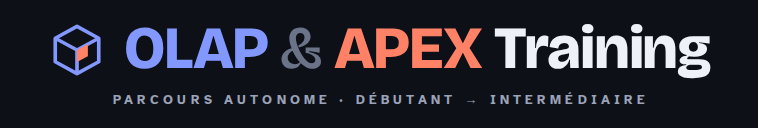
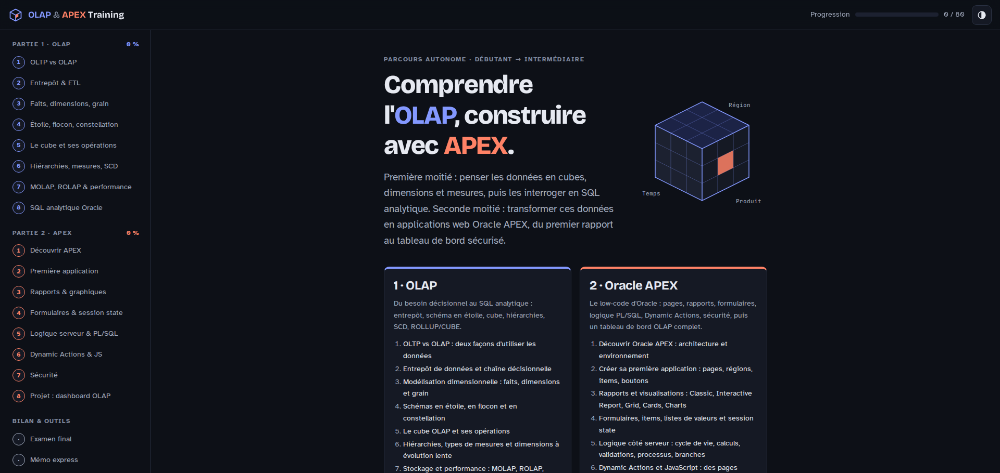

<h1 align="center">
  
</h1>


---

# OLAP & APEX Training — De débutant à intermédiaire

## Aperçu
Formation **autonome et 100 % en français** pour passer de **débutant à intermédiaire** sur deux sujets complémentaires :

1. **OLAP** et la modélisation décisionnelle (50 %) : entrepôt de données, schémas en étoile, cube, hiérarchies, SCD, SQL analytique Oracle ;
2. **Oracle APEX** (50 %) : pages, rapports, formulaires, logique PL/SQL, Dynamic Actions, sécurité, puis un tableau de bord OLAP complet.

Tout tient dans **une page web statique** : ouvrez `index.html` dans un navigateur, sans installation ni serveur. Un **projet fil rouge** (`sql/fil_rouge_ventes.sql`) fournit une vraie étoile de ventes pour pratiquer sur une base Oracle.

## Fonctionnalités

### Parcours de formation (`index.html`)
- **16 notions** réparties en deux parties (8 OLAP, 8 APEX), chacune avec des **objectifs**, un **cours détaillé** (schémas, tableaux, exemples SQL / PL/SQL / JavaScript réels) et un encadré **À retenir**
- **80 exercices** : pour chaque notion, **3 QCM** corrigés automatiquement (avec explication) et **2 questions ouvertes** (zone de réponse, correction détaillée, points clés attendus, auto-évaluation)
- **Laboratoire interactif** sur le cube : slice, dice, roll-up, drill-down et pivot en direct
- **Coloration syntaxique** SQL et JavaScript des exemples

### Annexes
- **Examen final** : 12 questions mêlant les deux parties
- **Mémo express** : l'essentiel à revoir en quelques minutes
- **Glossaire filtrable** : 53 termes
- **Ressources** pour aller plus loin

### Confort
- **Progression enregistrée** (réponses, scores, textes saisis) dans le `localStorage` du navigateur, avec une barre de progression par partie ; le bouton « Réinitialiser ma progression » du sommaire l'efface
- Thème **clair / sombre / système**
- Mise en page **responsive** : sommaire latéral sur ordinateur, menu repliable sur mobile

## Technologies
- **HTML / CSS / JavaScript** — site statique, sans framework ni build (`index.html`, `assets/`)
- **SQL / PL/SQL Oracle** — jeu de données du projet fil rouge (`sql/fil_rouge_ventes.sql`, Oracle 12c et plus)
- **Oracle APEX** — plateforme low-code utilisée dans la seconde partie

## Installation

Clonez le dépôt :

```bash
git clone https://github.com/Pierre-Portfolio/Olap-Apex-Training.git
cd Olap-Apex-Training
```

Aucune dépendance n'est requise.

### Lancer la formation

- **En local** : ouvrez simplement `index.html` dans un navigateur (double-clic) — aucun serveur n'est nécessaire.
- **En ligne** : le site est 100 % statique et peut être servi tel quel par **GitHub Pages** (Settings > Pages > branche `main`, dossier racine).

### Préparer la base du projet fil rouge

Un workspace APEX gratuit s'obtient sur [apex.oracle.com](https://apex.oracle.com/) ou via l'offre Always Free d'Oracle Cloud. Pour exécuter le script : APEX > **SQL Workshop > SQL Scripts > Upload**, puis **Run** (ou SQL Developer / SQLcl). Le script peut être relancé : il supprime puis recrée ses propres objets.

## Structure du projet
```
Olap-Apex-Training/
  README.md                  → Présentation du projet
  index.html                 → Page principale (en-tête, accueil, sommaire)
  assets/
    css/style.css            → Thème clair / sombre, mise en page responsive
    js/core.js               → Registre des notions, coloration SQL/JS, helpers
    js/notions/*.js          → Une notion par fichier (cours + 5 exercices)
    js/extras.js             → Examen final, mémo, glossaire, ressources
    js/app.js                → Rendu, exercices, progression, thème, navigation
    images/github/           → Images README
  sql/
    fil_rouge_ventes.sql     → Jeu de données du projet fil rouge
```

## Contenu de la formation

| Partie | Notions | Exercices |
| --- | --- | --- |
| OLAP | 1. OLTP vs OLAP · 2. Entrepôt & ETL · 3. Faits, dimensions, grain · 4. Étoile, flocon, constellation · 5. Le cube et ses opérations (avec laboratoire interactif) · 6. Hiérarchies, additivité, SCD · 7. MOLAP/ROLAP, vues matérialisées, partitionnement · 8. SQL analytique (ROLLUP, CUBE, GROUPING SETS, fonctions de fenêtrage) | 40 |
| APEX | 1. Architecture & environnement · 2. Première application · 3. Rapports & graphiques · 4. Formulaires & session state · 5. Logique serveur & PL/SQL · 6. Dynamic Actions & JavaScript · 7. Sécurité · 8. Projet fil rouge : dashboard OLAP et déploiement | 40 |

### Projet fil rouge (`sql/fil_rouge_ventes.sql`)

Le script crée dans votre schéma une **étoile de ventes réaliste** — une enseigne de cycles : **12 magasins**, **4 régions**, **24 produits**, environ **60 000 lignes de faits** de 2023 à aujourd'hui — ainsi que des tables applicatives et une vue pour les rapports interactifs. Il sert aux exercices de la partie OLAP et au projet APEX.

| Objet | Rôle |
| --- | --- |
| `DIM_TEMPS` | Dimension calendaire (jour, semaine ISO, mois, trimestre, année) |
| `DIM_PRODUIT` | Dimension produit (catégorie, sous-catégorie, marque, prix) et colonnes SCD de type 2 |
| `DIM_MAGASIN` | Dimension magasin (ville, département, région, type) |
| `FAIT_VENTES` | Table de faits des ventes |
| `OBJECTIFS_VENTES` | Objectifs mensuels par magasin, modifiables depuis APEX |
| `DROITS_REGION` | Droits d'accès par région (sécurité des données dans APEX) |
| `V_VENTES_DETAIL` | Vue dénormalisée pour les rapports interactifs |

## Comment l'utiliser

- **Suivre le parcours** : commencez par la partie **OLAP**, notion par notion, dans l'ordre du sommaire. Lisez le cours, puis faites les 5 exercices avant de passer à la suite.
- **S'entraîner sur une vraie base** : exécutez `sql/fil_rouge_ventes.sql` dans votre workspace APEX dès la partie OLAP, et rejouez les requêtes des cours sur ces données.
- **Construire l'application** : la partie **APEX** fait bâtir, étape par étape, un tableau de bord OLAP sécurisé sur l'étoile du fil rouge.
- **Valider ses acquis** : passez l'**examen final**, puis gardez le **mémo express** et le **glossaire** sous la main.

> Astuce : ajouter une notion = créer un fichier dans `assets/js/notions/` qui appelle `Course.add({...})` (voir un fichier existant pour le format), puis l'inclure dans `index.html` avant `extras.js`.

## Aperçu de l'interface


## Auteur
- [Pierre-Portfolio](https://github.com/Pierre-Portfolio/)

---

<p align="center">Projet réalisé en 2026.</p>
